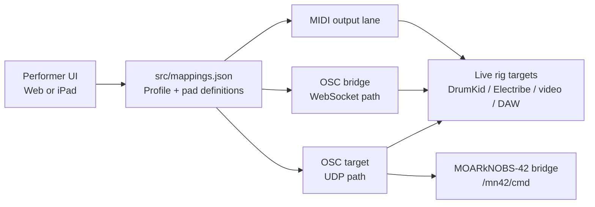
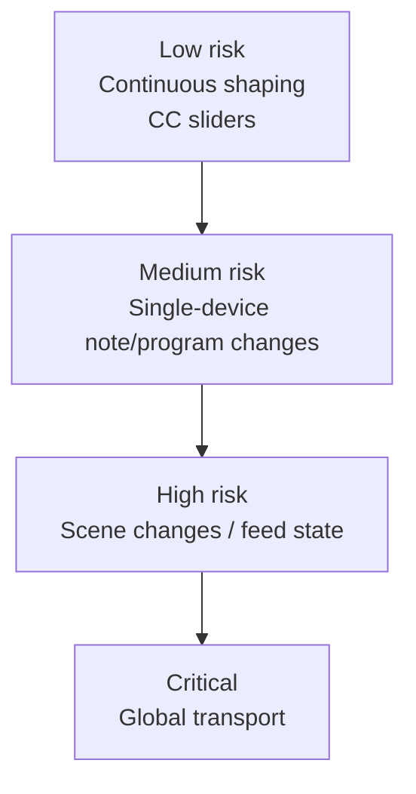

# Control Reference

This document answers two practical questions:

1. What does `live-rig-control` actually send into the rig?
2. Why are those controls grouped the way they are?

It is intentionally more verbose than the field card. The goal is to make the
surface auditable by a future you, a collaborator, or anyone trying to debug a
show file under pressure.

## Big Picture

`live-rig-control` is not "the rig." It is the performer-facing surface that
fires messages into other systems.

- Some pages control instruments over MIDI.
- Some pages control video or software state over OSC.
- Some pages are intentionally isolated because they are high-risk.
- One page (`mn42Slots`) targets a separate controller bridge rather than the
  main live rig.

## Signal Overview



## Mental Model

Think of the surface as a set of control lanes:

```text
+------------------+----------------------+--------------------------------------+
| Lane             | Transport            | Why it exists                        |
+------------------+----------------------+--------------------------------------+
| Drum lane        | MIDI Ch 10           | Fast rhythmic performance controls   |
| Synth/FX lane    | MIDI Ch 11           | Sound-shaping and insert controls    |
| Video lane       | OSC scenes + MIDI CC | Keep scene semantics separate from shaping |
| Utility lane     | MIDI Ch 1-2 / RT     | Patterns, transport, side inputs     |
| External bridge  | OSC /mn42/cmd        | Drive MOARkNOBS-42 slot updates      |
+------------------+----------------------+--------------------------------------+
```

The channel and transport split is not arbitrary. It is there to reduce
cross-talk and reduce catastrophic mistakes.

## Why The Surface Is Split Into Profiles

The repo currently defines these profiles in `src/mappings.json`:

| Profile ID | Label | Pads | Primary Transport | Why this profile exists |
| --- | --- | ---: | --- | --- |
| `msvp` | MSVP | 17 | OSC scenes + MIDI CC | Explicit MSVP page for scenes, macro shaping, and analysis shaping. |
| `nwWrldFeed` | nw_wrld Feed (OSC) | 12 | OSC | Video/software feed state does not belong on instrument channels. |
| `nwWrldInput` | nw_wrld Input (MIDI) | 26 | MIDI note | A dedicated note-trigger page for NW World input lanes. |
| `patterns` | Patterns | 1 | MIDI note | Keep pattern changes small and explicit. |
| `pcm30Macros` | PCM-30 Macros (Ch11) | 19 | MIDI note + CC | Quick insert/macro gestures without opening the full synth page. |
| `drumStack` | DrumKid Controls (Ch10) | 16 | MIDI CC | Continuous drum-engine parameter shaping. |
| `drumStackNotes` | Drum Stack Notes (Ch10) | 47 | MIDI note | Dense hit surface for live drum triggering. |
| `electribe` | Electribe 2S (Ch11) | 25 | MIDI CC + Program | Full sound-design and pattern-selection page. |
| `transport` | Transport | 3 | MIDI realtime | High-risk global sync control, isolated on purpose. |
| `mn42Slots` | MOARkNOBS-42 Slots (OSC Bridge) | 42 | OSC | External controller bridge lane, separate from the main rig. |

## Channel And Transport Plan

```mermaid
flowchart TB
    subgraph MIDI["MIDI lanes"]
        CH10[Ch 10\nDrum lane]
        CH11[Ch 11\nSynth + insert lane]
        CH10MSVP[Ch 10\nMSVP macro lane]
        CH15[Ch 15\nMSVP analysis lane]
        CH1[Ch 1\nPatterns / utility]
        CH2[Ch 2\nNW World input lane B]
        RT[MIDI realtime\nStart / Continue / Stop]
    end

    subgraph OSC["OSC lanes"]
        OSCRIG[OSC rig commands\nMSVP scenes + nw_wrld feed]
        OSCMN42[/mn42/cmd\nMOARkNOBS-42 bridge]
    end
```

### Why these lanes exist

- `Ch 10` is the drum lane because it is the least surprising place for
  percussive triggering and drum-related CC.
- `Ch 10` also carries the MSVP macro lane because it is a compact shaping
  lane, not a transport owner.
- `Ch 11` groups Electribe and PCM-30 macro controls so one sound-design lane
  lands on one target family.
- `Ch 15` isolates MSVP analysis bias from macro base intent, which keeps those
  two continuous roles easy to debug.
- `Ch 1-2` carry utility/input traffic where the rig can tolerate simpler,
  lower-density mappings.
- MIDI realtime is broken out because transport messages are global and should
  never share a crowded page with "normal" play gestures.
- OSC is used where the target is not naturally MIDI-shaped or where semantic
  scene commands are clearer than controller-style CC.

## Profile Walkthrough

### `msvp`

What it controls:

- Discrete scene triggers such as `Intro`, `Crash`, and `Soft`.
- A macro row on MIDI Ch 10 for base visual shaping.
- An analysis row on MIDI Ch 15 for biasing the same parameters on a separate lane.

Why it is separate:

- Scene changes are semantically different from continuous shaping.
- The performer should have one explicit MSVP page instead of inferring that a
  generic scene page also owns macro and analysis semantics.
- Scene commands are OSC-primary here to avoid accidental double-triggering.
- Transport ownership stays elsewhere: this page does not imply that MSVP owns clock.

### `nwWrldFeed`

What it controls:

- Feed enable/disable.
- Feed blackout.
- Named scene selections.
- Mix-state or software-state toggles.

Why it is OSC-only:

- These are software/service state changes, not expressive instrument gestures.
- OSC addresses communicate semantic intent better than overloading a spare MIDI
  channel with app-specific meaning.
- Keeping this lane out of MIDI makes it easier to reason about downstream
  routing and failure modes.

### `nwWrldInput`

What it controls:

- Input note triggers for the NW World slice on MIDI Ch 1 and Ch 2.

Why it exists as its own profile:

- Inputs are operationally different from feed-state toggles.
- The target likely wants note semantics, not OSC semantics.
- Splitting it from `nwWrldFeed` means "change the feed state" and "play the
  feed input" are not mixed together.

### `patterns`

What it controls:

- A minimal pattern-selection lane on MIDI Ch 1.

Why it is tiny:

- Pattern changes are important but dangerous.
- A compact profile makes pattern fire operations feel deliberate rather than
  ambient.
- This also gives room for the profile to grow later without mixing it into a
  denser page.

### `pcm30Macros`

What it controls:

- Quick macro gestures for the PCM-30 / insert side of the rig.
- A mix of notes and CC, mostly on MIDI Ch 11.

Why it is not merged into `electribe`:

- Macro moves are often performance gestures, not edit gestures.
- They deserve fast access with fewer visual distractions.
- The overlap in channel does not imply they should share the same UX density.

### `drumStack`

What it controls:

- Continuous DrumKid parameter control over MIDI CC on Ch 10.
- Things that are better expressed as values than as on/off pads.

Why it is slider-heavy:

- Drum-engine parameters are continuous, not binary.
- A slider says "shape this" more honestly than a toggle says "switch this."
- Grouping them together gives one page for changing the drum engine without
  crowding the note surface.

### `drumStackNotes`

What it controls:

- Drum notes and note-like hits on Ch 10.
- This is the dense playable drum page.

Why it is separate from `drumStack`:

- Triggering and shaping are different performance modes.
- A pad-dense page optimized for playing should not also carry a lot of sliders.
- Splitting notes from parameters reduces accidental value changes mid-play.

### `electribe`

What it controls:

- Electribe 2S CC parameters on Ch 11.
- Program/bank-oriented pattern selection controls.

Why it is built this way:

- It is the main "sound design" page.
- CC sliders are needed for honest parameter editing.
- Program and bank controls are kept on the same page because pattern selection
  is musically coupled to sound design for this device.

### `transport`

What it controls:

- MIDI realtime `Start`, `Continue`, and `Stop`.

Why it must remain isolated:

- These messages are global, not local.
- A stray `Stop` can collapse the show in a way a wrong CC usually does not.
- The profile exists to force intent before sending global sync control.

## Validation

The focused MSVP contract mirror lives in `contracts/msvp_live_rig_control.yaml`.
Validate the controller mapping and, when available, the sibling MSVP checkout with:

```bash
python3 tools/validate_msvp_live_rig_control.py
```

### `mn42Slots`

What it controls:

- 42 slider values addressed to the MOARkNOBS-42 bridge over OSC.
- Each slider sends `/mn42/cmd` with a JSON string payload like:

```json
{"cmd":"SET_POT","slot":0,"value":64}
```

Why it exists here:

- The iPad/web surface can act as an upstream controller for another controller.
- That gives you a remote "slot value" page without changing the MN42 firmware.
- This lane is intentionally separate from the main rig pages because it is not
  targeting the same control topology.

## Why Some Controls Use MIDI And Others Use OSC

```text
If the target thinks in notes/CC/programs/realtime:
  use MIDI.

If the target thinks in semantic commands, feed states, scene names,
or bridge commands:
  use OSC.
```

More concretely:

- MIDI is used for devices that already live on channels and expect musical or
  controller data.
- OSC is used for software endpoints, semantic feed/scene commands, and the
  MOARkNOBS-42 bridge command surface.
- Hybrid pads exist where one performer gesture should fan out to both a MIDI
  target and an OSC target.

## Why Stable IDs Matter

Each pad has a stable `id` because labels are the most likely thing to change.

That matters for:

- UI state restoration.
- Cross-device parity between web and iPad.
- Future logging or automation hooks.
- Human memory: once a pad is "the intro scene pad," renaming the label should
  not change the identity of the underlying control.

## Risk Hierarchy

Not all controls are equally dangerous. The current structure already encodes a
rough risk model:



The profile split follows that hierarchy:

- Low-risk shaping controls can be dense.
- Medium-risk note pages can be playable and dense.
- High-risk scene/feed pages should stay semantically clear.
- Critical transport controls should remain isolated.

## Operator Heuristics

If you are adding a new control, ask:

1. Is this a trigger, a continuous parameter, or a system-state command?
2. Does it belong on an existing lane, or would that make the page harder to
   trust in performance?
3. If this fires accidentally, what is the blast radius?
4. Is the target fundamentally MIDI-shaped or OSC-shaped?
5. Does the name of the profile still describe performer intent?

If the answer to "what happens when this misfires?" is "the set derails," the
control probably deserves either its own profile or a very isolated area of an
existing one.

## Future Documentation Work

The next level of detail would be a per-pad operator catalog generated from
`src/mappings.json`, including:

- pad `id`
- label
- profile
- transport
- channel/address
- downstream target
- short performance rationale

That would be useful if this repo becomes the canonical performer handbook
instead of just the runtime control surface.
